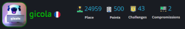

<h1 align="center">Salut 👋, c'est Tanguy Bron</h1>
<h3 align="center">Passionné de cybersécurité. Actuellement étudiant en école d'ingénieur</h3>
              

  

  
Trophées GitHub 🏆

  

- 📑 Propose des rapports et mémos sur certains CTF : [rapport CTF](https://tanguybron.gitlab.io/rapport-cyb/) et [notes / mémos CTF](https://tanguybron.gitlab.io/pentesting-notes/)

- 🔭 J'ai travaillé sur [Cybersec du Dimanche](https://tanguybron.github.io/cybersec-du-dimanche/html/index.html)

- 🔐 Projet d'un gestionnaire de mot de passe sur réseau local : [SecUrKey](https://github.com/tanguybron/SecUrKey)

- 📄 Pour en savoir plus sur mes expériences : [LinkedIn](https://www.linkedin.com/in/tanguy-bron-5396b91b9/)

 

<h3 align="left">Connect with me:</h3>

<h3 align="left">Languages and Tools:</h3>

          

 

  
  

